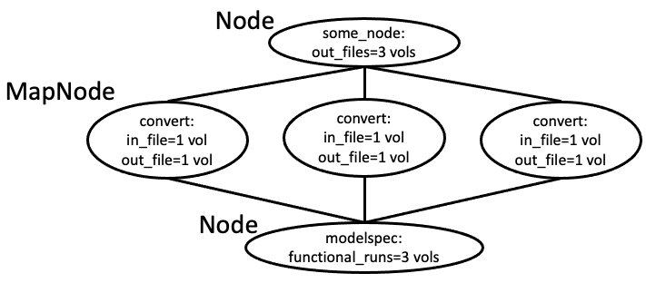

# 

## Why Nipype?
1. Pulls most neuroimaging software packages into one tool. Choose and combine functions from different packages.
2. Free and open-source.
3. Caches past runs of workflow, and re-runs accordingly.
4. Easy parallelization.


## Installation
Let's create a virtual environment (pop quiz!) in which to install nipype and its friends.

```bash
# 1. set-up and activate virtual env
module load miniconda3/py39_4.11.0-ncf
python -m venv nipype39_venv
source nipype39_venv/bin/activate

# 2. install nipype and friends
pip install nipype pytest sphinx networkx==3.0 nibabel==2.0.4

# 3. test install
python -c "import nipype; print(nipype.__version__)"
python -c "import nipype; nipype.test()"
# You will probably get warnings, but make sure you don't have any errors or fails.
```

!!! note ""
    To access the [_full code of nipype_spm1stlevel.py (**LINK**)_](https://github.com/harvard-nrg/python-workshop/blob/main/docs/code/nipype_spm1stlevel.py)

## Interface, Node, Workflow
A nipype pipeline is composed of 3 differently "sized" objects, from smallest to largest:
1. Interfaces,
2. Nodes, and
3. Workflows


### Interfaces: Functions for *fun* pipelines!
*(Sorry I couldn't help myself.)*

[_Interfaces_](https://nipype.readthedocs.io/en/latest/interfaces.html) are Python functions that wrap the magical (mostly neuroimaging) tools from other software packages (e.g., fslmaths from FSL or recon-all from Freesurfer)

Like modules, interfaces aren't Python built-ins, so their modules must be imported at the beginning of your Python script (lines 1-13 of [_nipype_spm1stlevel.py **LINK**_](https://github.com/harvard-nrg/python-workshop/blob/main/docs/code/nipype_spm1stlevel.py)):
```python
from nipype.interfaces import fsl, spm
```
Then, we can call things that we imported as, for example: `spm.EstimateContrast()`


### Nodes: Happy package for an interface
Nodes contain the wrapped interfaces, but also:
1. inputs (including input files, or any specified paramaters), and
2. outputs.

Let's choose a simple example: [_Freesurfer's mri_convert_](https://nipype.readthedocs.io/en/latest/api/generated/nipype.interfaces.freesurfer.preprocess.html#mriconvert).

To create a node:
```Python
from nipype.pipeline import engine as pe

nodeVariableName = pe.Node(package.function(), name="nameForOutputDirectory")
```

For example (lines 138-161 of *nipype_spm1stlevel.py*):
```python
convert = pe.Node(freesurfer.MRIConvert(), name="convert")

# now we can set the inputs
convert.inputs.in_file = 'structural.nii.gz'
convert.inputs.out_type = 'nii'
```

#### MapNode
Now in the mri_convert example above, we had a Node which took a single input (1 volume) and a single output (1 volume), but in reality, you might have a bunch of images that need to be converted, but then reconverge as a single list (of multiple volumes) when it's passed on to another node. Then you'll need a **MapNode**.



Lines 140-142 of *nipype_spm1stlevel.py*:
```python
convert = pe.MapNode(freesurfer.MRIConvert(), name="convert", iterfield=['in_file'])
convert.inputs.in_file = funcFiles # more on how I made this object later
convert.inputs.out_type = 'nii'
```

#### Iterfield
The `iterfield` entry is not limited to files or to MapNodes. You could use it for any input. For instance, if you're doing smoothing and want to try a bunch of different kernels, this input parameter could go in the iterfield. Or if you're doing a second level analysis over many contrasts, this could also go in the iterfield.


A hypothetical example:
```python
smooth = pe.Node(spm.Smooth(), name="smooth", iterfield=['fwhm'])
smooth.inputs.fwhm = [[2, 2, 2],[4, 4, 4]]
```

### Workflow: Connecting nodes and passing data
Workflows are the biggest "thing" in nipype. It links a series of nodes.

#### To create a workflow (lines 166-167): ####

```python
l1analysis = pe.Workflow(name='nipype_1stlevel')
l1analysis.base_dir = os.path.join(baseDir, outDir)
```

The important property of workflows is that it links the nodes. In the above Node and MapNode examples, we gave the node its input, but if we really want to use Nipype, one node is going to pass its *output* to another node's *input*.

#### To connect nodes in a workflow ####
So after we make our nodes, we can connect them and tell the workflow which output should go to which input. The basic format is:

```Python
workflowname.connect([(node1name, node2name, [('node1outputparameter','node2inputparameter')] )])
```

For example (lines 172-175):
```Python
l1analysis.connect([(convert, modelspec, [('out_file', 'functional_runs')]),
                    (modelspec, level1design, [('session_info', 'session_info')]),
                    (level1design, level1estimate, [('spm_mat_file', 'spm_mat_file')]),
                    (level1estimate, contrastestimate, [('spm_mat_file', 'spm_mat_file'),
                                                        ('beta_images', 'beta_images'),
                                                        ('residual_image','residual_image')])])
```
#### To run a workflow (lines 197-199): ####
There are several options for how to run your workflow.
```python
l1analysis.run(plugin='MultiProc',plugin_args={'n_procs':2})
l1analysis.write_graph()
```
You can run with other [_plugins_](https://nipype.readthedocs.io/en/0.11.0/users/plugins.html), but FASSE seems to like this best.

## Getting data in and out of your pipeline
There are many ways to get your data in and out of a nipype workflow, but my favorites are BIDSLayout and datasync.

### Data in: BIDSLayout
BIDSLayout is from pybids (not nipype), but if your data in already in BIDS format (which it should be :), I find this to be the easiest way to grab imaging data.

For instance, to grab your fMRIPrep-ed functional files:
```Python
layout = BIDSLayout(BIDSDir, derivatives=True, validate=False)
funcFiles = layout.get(datatype='func', subject=subName,
                       task=task, session=sesName, space=space,
                       suffix='bold', extension='nii.gz',
                       return_type='filename')
```
Anything that's specified in a `thing-spec` (e.g., `direction-AP`) format in your BIDS-compliant file name is fair game. Also, note that if you want something from your raw data directory (aka `bids` as opposed to the `bids/derivatives` directory), set `derivatives=False`.

### Data out: DataSink
Nipype automatically outputs all the outputs of each node to its own directory, but it can be a bit messy, especially for MapNodes or Nodes with iterfields (e.g., *nipype_1stlevel/convert/mapflow/_convert0/out_file.nii*).


But a **DataSink** Node lets you choose which files you want and their organizational structure.

So first, you make your DataSink Node like any other Node (line 183-184):

```python
datasink = pe.Node(nio.DataSink(), name="datasink")
datasink.inputs.base_directory = os.path.join(baseDir,outDir)

```

Then you connect any outputs you like to *datasink*. Notice that the `grumpy.@cat` structure; it will create a folder called *grumpy* and name the files with the *cat* prefix. If you just put a regular string, it will put the files in a directory of that name (like the SPM.mat files below)

```python
l1analysis.connect([(contrastestimate, datasink,[('con_images', 'contrasts.@con'),
                                                 ('spmT_images', 'contrasts.@T')]),
                    (level1estimate, datasink,[('spm_mat_file', 'spm_mat')])])
```


#### Another output: Workflow graph ####

One other nice feature of Nipype is that it automatically gives you a nice figure showing the connected graph of your nodes. It will be in the main output directory, called *graph.png*

For example:


## Running your nipype script (and accessing software packages)
Nipype is providing functions which Python-ize *access* to tools that may be written in another language, but not the tools themselves. You still need to `module load` (if on FASSE) or install the software packages.

The tricky thing is that we can't load the modules in any permanent way from *within* Python. If you're on FASSE, I suggest having a **separate script** that loads the necessary modules and then calls the Python script. ([_Example script: run_spm1stlevel.sh **LINK**_](https://github.com/harvard-nrg/python-workshop/blob/main/docs/code/run_spm1stlevel.sh))

```bash
#!/bin/bash
# if running on SLURM, could put all your #SBATCH lines here...

module load ncf
module load matlab/R2020b-fasrc01
module load spm/12.7487-fasrc01
module load freesurfer/6.0.0-ncf
module load fsl/6.0.4-ncf

python nipype_spm1stlevel.py
```

Then you would run this as:
```bash
sh run_spm1stlevel.sh
```

or if you're running on SLURM
```bash
sbatch run_spm1stlevel.sh
```
